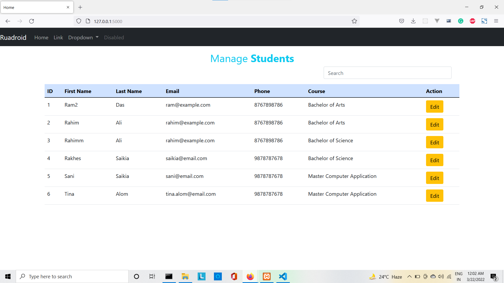
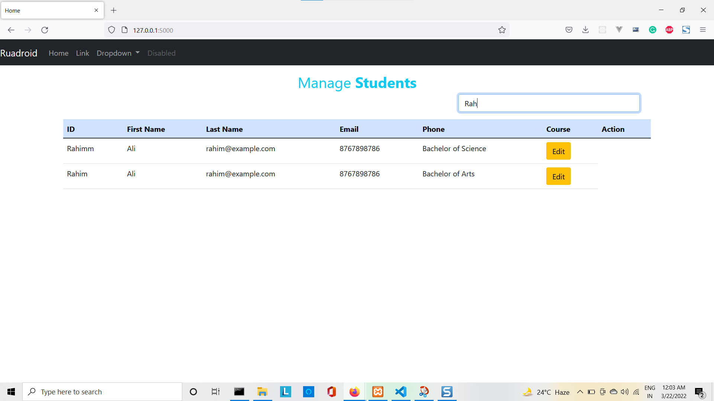
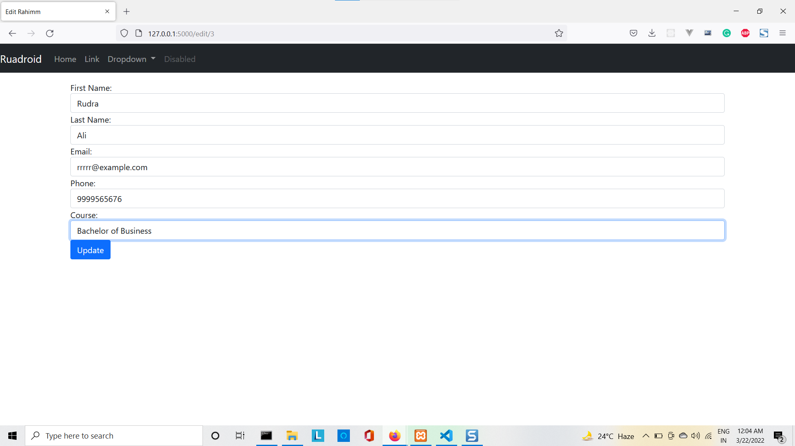
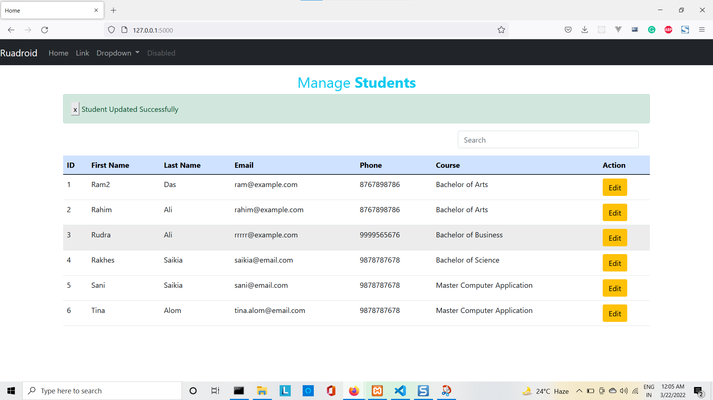

# Live Data Search using Flask, MySQL and Ajax

## Setup

Execute the following commands:

    git clone https://github.com/sanikamal/flask-ajax-search.git
    cd flask-ajax-search
    virtualenv venv
    venv\Scripts\activate
    pip install -r requirements.txt

## Running

Execute the following command:

    python app.py

Open at your Web browser the following link http://127.0.0.1:5000

